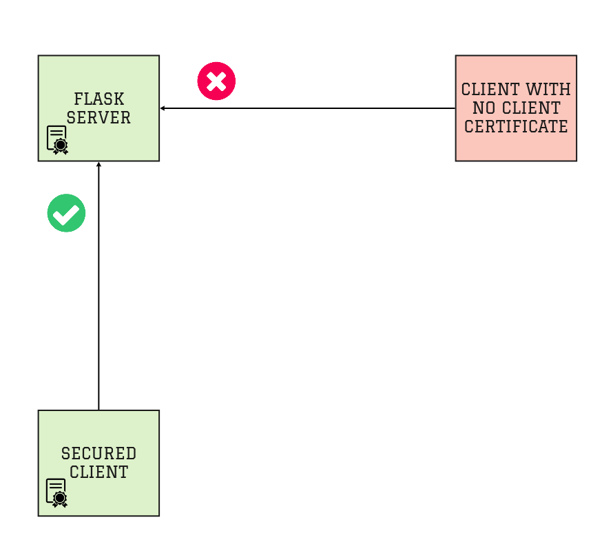

# Flask mTLS

This repository provides an example of an mTLS secured client-server flask application.

The `server.py` script deploys a secured Flask webserver.

The `client.py` script runs a client that authenticates against the secured Flask webserver using a client certificate.

The [certificates](certificates) directory contraints the next certificates -
* CA (certificate authority) certificate
* Server certificate (used by the Flask server)
* Client certificate (used by the python client to authenticate against the flask server)

In order to create your own certificates, you may follow the instructions at - https://gist.github.com/komuw/076231fd9b10bb73e40f

## Overview

The deployed architecture is described in the next diagram -



## Running the Flask Server

To run the Flask server, run the next commands - 
```
$ git clone https://github.com/michaelkotelnikov/flask-mtls.git

$ ./server.py
```

The Flask server will use the certificates in the GitHub repository automatically.

## Running the Client

To run the client that authenticates against the secured Flask web server, run the next commands -
```
$ git clone https://github.com/michaelkotelnikov/flask-mtls.git

$ ./client.py
Hello Cloudlet
```

Try accessing the Flask server without a valid client certificate. See the next result -
```
$ curl https://127.0.0.1:5000 -k
curl: (56) OpenSSL SSL_read: error:1409445C:SSL routines:ssl3_read_bytes:tlsv13 alert certificate required, errno 0
```